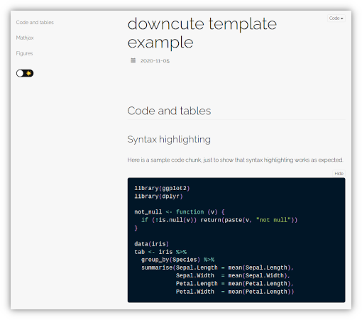
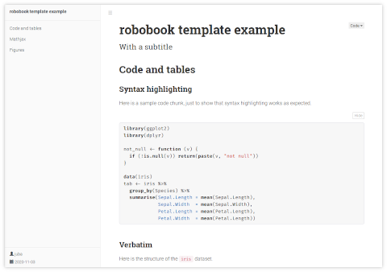
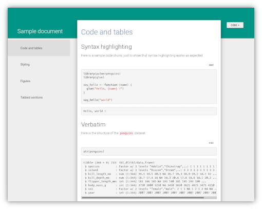
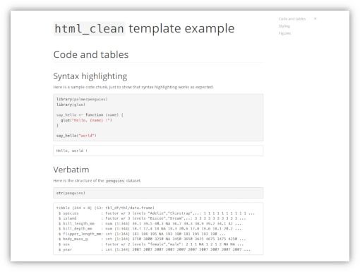
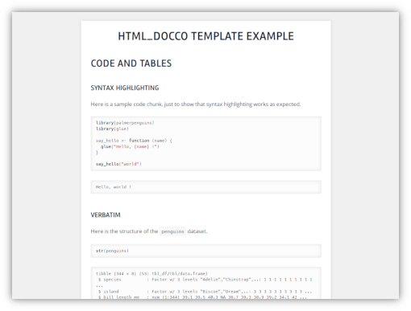

# rmdformats

[](https://cran.r-project.org/package=rmdformats)

[](https://github.com/juba/rmdformats/actions?query=workflow%3AR-CMD-check)


This R package provides ready-to-use HTML output formats and templates for
RMarkdown documents. The goal is to produce clean documents "out of the box",
with or without the RStudio IDE.

## Formats gallery

The package provides several HTML output formats. You can click on an image to see a real HTML output sample.

### `downcute` 

Taken from the [docute](https://docute.org) project theme and its adaptation by [John Coene](https://twitter.com/jdatap). Responsive, with a dynamic table of contents and a dark theme switcher.

[](https://cdn.rawgit.com/juba/rmdformats/master/resources/examples/downcute/downcute.html)


### `robobook`

Adapted from the [bookdown](https://bookdown.org/) theme, with Roboto family fonts. Fully responsive with dynamic table of contents and collapsible navigation.

[](https://cdn.rawgit.com/juba/rmdformats/master/resources/examples/robobook/robobook.html)


### `material` 

Format taken from the [Material design theme for Bootstrap 3](https://github.com/FezVrasta/bootstrap-material-design). Document is split into pages at each `<h1>` header, and the table of contents allows an animated navigation between these pages (you can use the `cards: false` preamble parameter to disable the splitting and display all the cards at once).

[](https://cdn.rawgit.com/juba/rmdformats/master/resources/examples/material/material.html)


### `readthedown`

Adapted from the corresponding `readtheorg` theme of the [org-html-themes](https://github.com/fniessen/org-html-themes) project, fully responsive with dynamic table of contents and collapsible navigation.

[](https://cdn.rawgit.com/juba/rmdformats/master/resources/examples/readthedown/readthedown.html)

### `html_clean` 

Simple and clean template with dynamic table of contents, very similar to the one from the great [knitrBootstrap package](https://github.com/jimhester/knitrBootstrap) by Jim
Hester.

[](https://cdn.rawgit.com/juba/rmdformats/master/resources/examples/html_clean/html_clean_sample.html)


### `html_docco` 

Simple template, no table of contents. CSS heavily inspired from the default one of the [docco](https://jashkenas.github.io/docco/) project.

[](https://cdn.rawgit.com/juba/rmdformats/master/resources/examples/html_docco/html_docco_sample.html)


## Features and helpers

### Features matrix


<table>
<thead>
    <tr>
    <th></th>
    <th>Responsive</th>
    <th>Dynamic TOC</th>
    <th>Dark mode</th>
    <th>Thumbnails</th>
    <th>Lightbox</th>
    <th>Code folding</th>
    <th>Tabsets</th>
    <th></th>
    </tr>
</thead>
<tbody>
<tr>
<td><strong>html_docco</strong></td>
<td>x</td>
<td></td>
<td></td>
<td>x</td>
<td>x</td>
<td>x</td>
<td>x</td>
<td></td>
</tr>
<tr>
<td><strong>html_clean</strong></td>
<td>x</td>
<td>x</td>
<td></td>
<td>x</td>
<td>x</td>
<td>x</td>
<td>x</td>
<td></td>
</tr>
<tr>
<td><strong>readthedown</strong></td>
<td>x</td>
<td>x</td>
<td></td>
<td></td>
<td></td>
<td>x</td>
<td>x</td>
<td></td>
</tr>
<tr>
<td><strong>material</strong></td>
<td></td>
<td></td>
<td></td>
<td>x</td>
<td>x</td>
<td>x</td>
<td>x</td>
<td></td>
</tr>
<tr>
<td><strong>robobook</strong></td>
<td>x</td>
<td>x</td>
<td></td>
<td>x</td>
<td>x</td>
<td>x</td>
<td>x</td>
<td></td>
</tr>
<tr>
<td><strong>downcute</strong></td>
<td>x</td>
<td>x</td>
<td>x</td>
<td>x</td>
<td>x</td>
<td>x</td>
<td>x</td>
<td></td>
</tr>
</tbody>
</table>


### Helpers

The package also provides a `create.doc()` function as well as RStudio document
templates to easily generate an empty and ready to use rmarkdown file with
several configuration directives.

Finally, it also provides the `pilltabs()` helper function, which allows to display a crosstab dynamically. See [one of the output samples](https://cdn.rawgit.com/juba/rmdformats/master/resources/examples/robobook/robobook.html#table) for a live example.


## Installation

You can install the latest stable release from CRAN :

```r
install.packages("rmdformats")
```

Or the latest development snapshot from GitHub :

```r
install.packages(remotes)  # if necessary
remotes::install_github("juba/rmdformats")
```

## Creating a new document

### Within RStudio

Choose `File` > `New File...` > `R Markdown...`, then select `From Template`.
You should then be able to create a new document from one of the package
templates.

### Without RStudio

The `create.doc()` function allows you to create a new directory with a clean
ready-to-use RMarkdown file. `create.doc()` gets two main arguments :

- `dirname` is the name of the folder and RMarkdown file to be created
- `format` is the format name (`"html_clean"` or `"html_docco"`)

By default, a `Makefile` file will be created in the new folder for direct
rendering from the command line.

## Rendering

### With RStudio

Rendering from within RStudio should be quite simple : just click the `Knit` button.

### Rendering from R

You can render your document into HTML directly from within R with the
`render()` function from the `rmarkdown` package :

```r
library(rmarkdown)
render("mydocument.Rmd")
```

### Rendering with the Makefile

If you created your `.Rmd` file with the `create.doc()` function, you can then
generate HTML or PDF files with :

```    
make html
make pdf
```

You can also clean out any generated files and cache with :

```
make clean
```


## Credits

- [Magnific popup](http://dimsemenov.com/plugins/magnific-popup/) lightbox plugin
- The code of `create.doc()` is heavily inspired by the `create.project()` function of the [ProjectTemplate package](http://projecttemplate.net/)
- The CSS for the `html_docco` format is heavily inspired from the default one of the [docco](https://jashkenas.github.io/docco/) project.
- The CSS and JavaScript for `readthedown` is adapted from the corresponding `readtheorg` theme of the [org-html-themes](https://github.com/fniessen/org-html-themes) project, which is itself inspired by the [Read the docs](https://readthedocs.org/) [Sphinx](http://sphinx-doc.org/) theme.
- The CSS and JavaScript for `material` has been taken from the [Material design theme for Bootstrap 3](https://github.com/FezVrasta/bootstrap-material-design) project and its [presentation page](https://fezvrasta.github.io/bootstrap-material-design/)
- The CSS for `robobook` is directly derived from the [bookdown](https://bookdown.org/) project template.
- The CSS for `downcute` is directly derived from the default theme of the [docute](https://docute.org) project and its adaptation by [John Coene](https://twitter.com/jdatap) for some of its [projects documentation](https://packer.john-coene.com/).
- JavaScript and HTML code for code folding and tabbed sections are taken from the RStudio's default `rmarkdown` HTML template

The `html_clean` styling and features are very similar to the ones from the great
[knitrBootstrap package](https://github.com/jimhester/knitrBootstrap) by Jim
Hester.
