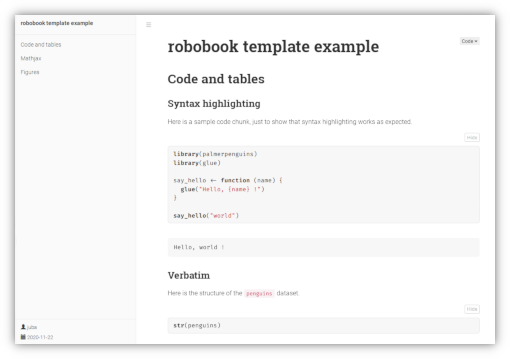
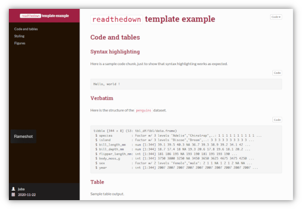

# rmdformats

[](https://cran.r-project.org/package=rmdformats)

[](https://github.com/juba/rmdformats/actions?query=workflow%3AR-CMD-check)


This R package provides ready-to-use HTML output formats and templates for
RMarkdown documents. The goal is to produce clean documents "out of the box",
with or without the RStudio IDE.

## Formats gallery

The package provides several HTML output formats. Click on any image to see an HTML output sample.

### `downcute` 

Taken from the [docute](https://github.com/egoist/docute) project theme and its adaptation by [John Coene](https://twitter.com/jdatap). Responsive, with a dynamic table of contents and a dark theme switcher.

[](https://juba.github.io/rmdformats/articles/examples/downcute.html)


### `robobook`

Adapted from the [bookdown](https://bookdown.org/) theme, with Roboto family fonts. Fully responsive with dynamic table of contents and collapsible navigation.

[](https://juba.github.io/rmdformats/articles/examples/robobook.html)


### `material` 

Format taken from the [Material design theme for Bootstrap 3](https://github.com/FezVrasta/bootstrap-material-design). Document is split into pages at each `<h1>` header, and the table of contents allows an animated navigation between these pages (you can use the `cards: false` preamble parameter to disable the splitting and display all the cards at once).

[](https://juba.github.io/rmdformats/articles/examples/material.html)


### `readthedown`

Adapted from the corresponding `readtheorg` theme of the [org-html-themes](https://github.com/fniessen/org-html-themes) project, fully responsive with dynamic table of contents and collapsible navigation.

[](https://juba.github.io/rmdformats/articles/examples/readthedown.html)

### `html_clean` 

Simple and clean template with dynamic table of contents, very similar to the one from the great [knitrBootstrap package](https://github.com/jimhester/knitrBootstrap) by Jim
Hester.

[](https://juba.github.io/rmdformats/articles/examples/html_clean.html)


### `html_docco` 

Simple template, no table of contents. CSS heavily inspired from the default one of the [docco](https://ashkenas.com/docco/) project.

[](https://juba.github.io/rmdformats/articles/examples/html_docco.html)

### `lockdown`

`lockdown` is an exact copy of the default RMarkdown `html_document` template, with an added functionality : each time you click on a link to get out, you'll see a friendly reminder to wash your hands and wear a mask. Yes, it is a (bad) attempt at a (bad) joke, sorry !

[](https://juba.github.io/rmdformats/articles/examples/lockdown.html)


## Features and helpers

### Features matrix


<table>
<thead>
    <tr>
    <th></th>
    <th>Responsive</th>
    <th>Dynamic TOC</th>
    <th>Dark mode</th>
    <th>Thumbnails / Lightbox</th>
    <th>Code folding</th>
    <th>Tabsets</th>
    <th>Bad joke</th>
    </tr>
</thead>
<tbody>
<tr>
<td><strong>html_docco</strong></td>
<td>x</td>
<td></td>
<td></td>
<td>x</td>
<td>x</td>
<td>x</td>
<td></td>
</tr>
<tr>
<td><strong>html_clean</strong></td>
<td>x</td>
<td>x</td>
<td></td>
<td>x</td>
<td>x</td>
<td>x</td>
<td></td>
</tr>
<tr>
<td><strong>readthedown</strong></td>
<td>x</td>
<td>x</td>
<td></td>
<td></td>
<td>x</td>
<td>x</td>
<td></td>
</tr>
<tr>
<td><strong>material</strong></td>
<td></td>
<td></td>
<td></td>
<td>x</td>
<td>x</td>
<td>x</td>
<td></td>
</tr>
<tr>
<td><strong>robobook</strong></td>
<td>x</td>
<td>x</td>
<td></td>
<td>x</td>
<td>x</td>
<td>x</td>
<td></td>
</tr>
<tr>
<td><strong>downcute</strong></td>
<td>x</td>
<td>x</td>
<td>x</td>
<td>x</td>
<td>x</td>
<td>x</td>
<td></td>
</tr>
<tr>
<td><strong>lockdown</strong></td>
<td></td>
<td></td>
<td></td>
<td></td>
<td></td>
<td></td>
<td>x</td>
</tr>
</tbody>
</table>


### Helpers

The package also provides RStudio document
templates to easily generate an empty and ready to use rmarkdown file with
several configuration directives.

It also provides the `pilltabs()` helper function, which allows to display a crosstab dynamically. See [one of the output samples](https://juba.github.io/rmdformats/articles/examples/robobook.html#table) for a live example.


## Installation

You can install the latest stable release from CRAN :

```r
install.packages("rmdformats")
```

Or the latest development snapshot from GitHub :

```r
install.packages(remotes)  # if necessary
remotes::install_github("juba/rmdformats")
```

## Creating a new document

Just create a new `Rmd` file and add the following in your YAML preamble :

```
---
output: rmdformats::<template name>
---
```

Within RStudio , you can also choose `File` > `New File...` > `R Markdown...`, then select `From Template`. You should then be able to create a new document from one of the package templates.


## Options

Depending on the features provided by the template, you can add the following options to your YAML preamble. Look at the template function help page for a valid list :

- `fig_width` : figures width, in inches
- `fig_height` : figures height, in inches
- `fig_caption` : toggle figure caption rendering
- `highlight` : syntax highlighting
- `thumbnails` : if TRUE, display content images as thumbnails
- `lightbox` : if TRUE, add lightbox effect to content images
- `gallery` : if TRUE, add navigation between images when displayed in lightbox
- `use_bookdown` : if TRUE, will use `bookdown` instead of `rmarkdown` for HTML rendering, thus providing section numbering and [cross references](https://bookdown.org/yihui/bookdown/cross-references.html).
- `embed_fonts` : if `TRUE` (default), use local files for fonts used in the template instead of links to Google Web fonts. This leads to bigger files but ensures that the fonts are available
- additional aguments are passed to the base `html_document` RMarkdown template


Example preamble :

```
---
title: "My document"
date: "`r Sys.Date()`"
author: John Doe
output:
  rmdformats::downcute:
    self_contained: true
    thumbnails: true
    lightbox: true
    gallery: false
    highlight: tango
---
```


## Credits

- [Magnific popup](https://dimsemenov.com/plugins/magnific-popup/) lightbox plugin
- The CSS for the `html_docco` format is heavily inspired from the default one of the [docco](https://ashkenas.com/docco/) project.
- The CSS and JavaScript for `readthedown` is adapted from the corresponding `readtheorg` theme of the [org-html-themes](https://github.com/fniessen/org-html-themes) project, which is itself inspired by the [Read the docs](https://readthedocs.org/) [Sphinx](http://sphinx-doc.org/) theme.
- The CSS and JavaScript for `material` has been taken from the [Material design theme for Bootstrap 3](https://github.com/FezVrasta/bootstrap-material-design) project and its [presentation page](https://fezvrasta.github.io/bootstrap-material-design/).
- The CSS for `robobook` is directly derived from the [bookdown](https://bookdown.org/) project template.
- The CSS for `downcute` is directly derived from the default theme of the [docute](https://github.com/egoist/docute) project and its adaptation by [John Coene](https://twitter.com/jdatap) for some of its [projects documentation](https://packer.john-coene.com/).
- JavaScript and HTML code for code folding and tabbed sections are taken from the RStudio's default `rmarkdown` HTML template.
- The `html_clean` styling and features are very similar to the ones from the 
[knitrBootstrap package](https://github.com/jimhester/knitrBootstrap) by Jim
Hester.
