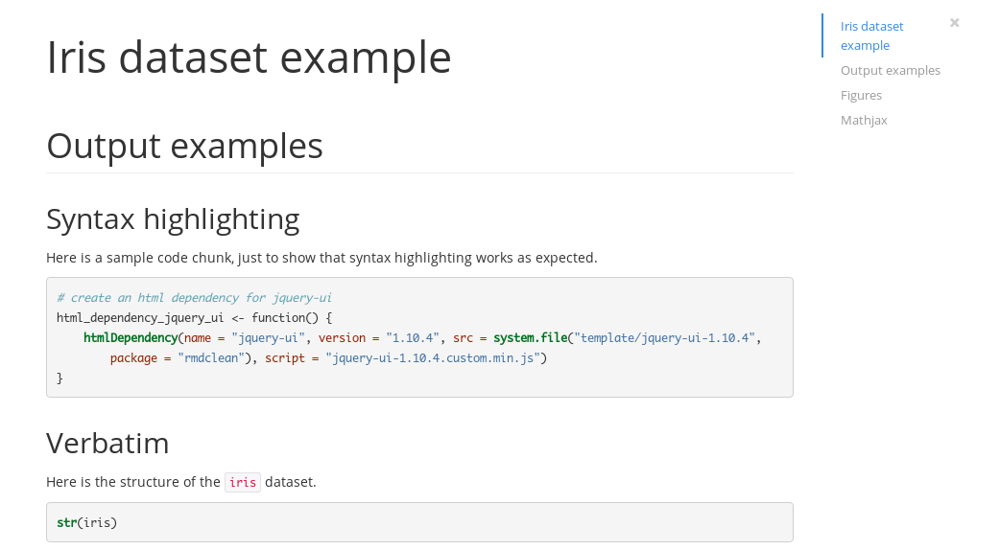
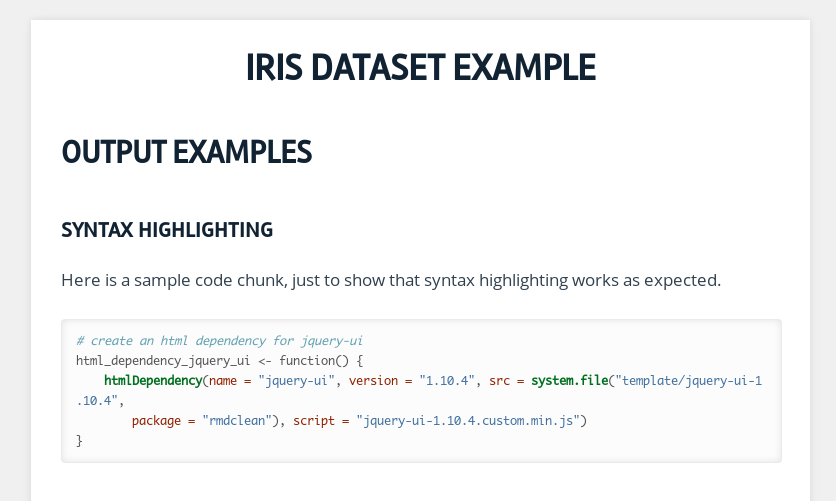

rmdformats
===============

This R package provides ready-to-use HTML output formats and templates for
RMarkdown documents. The goal is to produce clean documents "out of the box",
with or without the RStudio IDE.

## Formats and features

For now, the package provides two HTML output formats :

- the `html_clean` format ([Sample HTML output](https://rawgit.com/juba/rmdformats/master/inst/examples/html_clean/iris.html)) :

- the `html_docco` format ([Sample HTML output](https://rawgit.com/juba/rmdformats/master/inst/examples/html_docco/iris.html)) :
 :

Some extra features are available depending on the format, such as automatic and dynamic 
javascript table of contents or automatic thumbnails for figures with lightbox display.

The package also provide a `create.doc()` function as well as RStudio document
templates to easily generate an empty and ready to use RMarkdown file with
several configuration directives.

## Installation

The package is not available on CRAN, but it is installable from Github :

    library(devtools)
	install_github("juba/rmdformats")

## Creating a new document

### Within RStudio

Choose `File` > `New File...` > `R Markdown...`, then select `From Template`.
You should then be able to create a new document from one of the package
templates.

### Without RStudio

The `create.doc()` function allows you to create a new directory with a clean
ready-to-use RMarkdown file. `crate.doc()` gets two main arguments :

- `dirname` is the name of the folder and RMarkdown file to be created
- `format` is the format name (only `"html_clean"` and `"html_docco"` are available for now)

By default, a `Makefile` file will be created in the new folder for direct
rendering from the command line.

## Rendering

### With RStudio

Rendering from within RStudio should be quite simple : just click the `Knit` button.

### Rendering from R

You can render your document into HTML directly from within R with the
`render()` function from the `rmarkdown` package :

    library(rmarkdown)
    render('mydoc.Rmd)

### Rendering with the Makefile

If you created your `.Rmd` file with the `create.doc()` function, you can then
generate HTML or PDF files with :

    make html
    make pdf

You can also clean out any generated files and cache with `make clean`.

## Credits

- [Tocify](http://gregfranko.com/jquery.tocify.js/) for the dynamic javascript table of contents
- [Magnific popup](http://dimsemenov.com/plugins/magnific-popup/) lightbox plugin
- The code of `create.doc()` is heavily inspired by the `create.project()` function of the [ProjectTemplate package](http://projecttemplate.net/)
- The CSS for the `html_docco` format is heavily inspired from the default one of the [docco](https://jashkenas.github.io/docco/) project.

The `html_clean` styling and features are very similar to the ones from the great
[knitrBootstrap package](https://github.com/jimhester/knitrBootstrap) by Jim
Hester.
